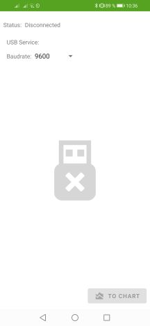
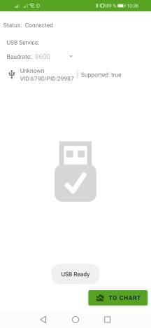
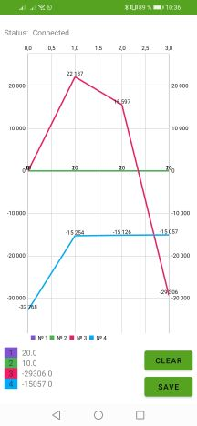
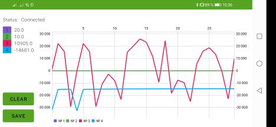
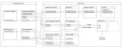

# Port Plotter for BGA rework stations

#### Построение графиков для самодельных паяльных станций на ардуино

**Приложение для обмена данными с ардуино**

Минимальная версия Android  - 4.4

## 🔗 Links

- [Инструкция по эксплуатации](https://github.com/jagerlipton/BGAPortPlotter_Manual.git "Ссылка на инструкцию")
- [Ссылка на приложение Google Play](https://play.google.com/store/apps/details?id=com.jagerlipton.bgaportplotter "Ссылка на приложение")
- [Ссылка на видео](https://youtu.be/fGopi7mpSbU "Видео на ютубе")

## 📃 ReadMe

- ✅ Kotlin
- ✅ MVVM
- ✅ DI (KOIN)
- ✅ Serial через библиотеку https://github.com/felHR85/UsbSerial
- ✅ Переиспользование кода из проекта ProfileEditor
- ⬜️ Поддержка bluetooth сервиса
- ⬜️ Изменение интерфейса, viewPager
- ⬜️ Расширение возможностей обмена данными с ардуино
- ⬜    Больше корутин
- ⬜    Чек на возможные ошибки передачи данных (лишние измерения, склейки сообщений, испорченны данные) 

## 📷 ScreenShots

|**Стартовый экран**|**Автоконнект при подключении**|
| :------------ | :------------ |
|||
|**График**|**Ориентация экрана**|
|||

## 📈 Scheme

> Диаграмма приложения

